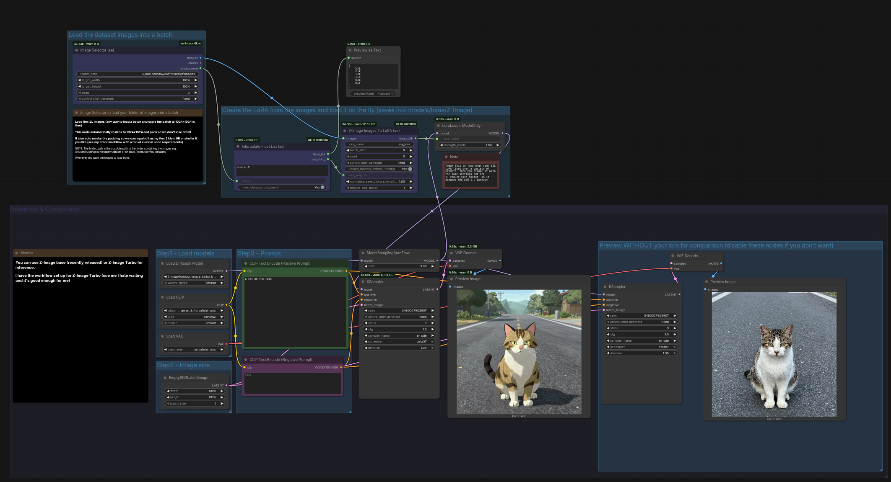

# In-workflow Nodes for ComfyUI

[](https://civitai.com/user/by_ae)

[](https://github.com/by-ae)
[](https://github.com/by-ae)

A collection of interactive nodes that provide convenient workflow tools for ComfyUI.



## NOTE:
```
I'm not sure if this is a normal way to do things, but rather than validation I simply use seed to trigger running the node again with the same inputs if I require.
Most of the time you will want to set these to Fixed for the node to run once and not again unless the inputs change.
But if you need them to proc again, just change the seed value and it will run again with the same inputs.
```

## HOTFIX:
```
The Z-Image i2L loads large models that can cause OOM errors.
To prevent this I've added a boolean (true/false) to unload all models before execution.
Recommend leaving it as True and things will just work as you expect.
```


## 🎯 NODES SO FAR:

**Z-Image - Images To LoRA**: Brings DiffSynth-Studio's Z-Image i2L pipeline into ComfyUI as a convenient single-node solution for converting image batches to LoRA models.

**Image Selector**: Interactive image selection from folders with thumbnail grid view and batch processing.

**Interactive Pose Editor**: Pose manipulation with multi-person support, hierarchical editing, undo/redo, and caching.

## 🔧 OTHER UTILS

**Interpolate Float List**: Process and interpolate comma-separated float lists.

## 🚀 Key Features

### ✨ Z-Image - Images To LoRA
- **🎯 Convenient LoRA Creation**: Turn image batches into LoRA models using DiffSynth-Studio's pipeline
- **🧠 Memory Efficient**: Includes VRAM management optimizations
- **📦 Batch Processing**: Handle large image sets with configurable batch sizes
- **🔢 Auto-Versioning**: Automatic version numbering to avoid overwrites
- **🔗 Direct Integration**: Accepts image batch input and outputs path that feeds directly into LoraLoaderModelOnly (you don't even need to refresh, it's single pass)

### 🎭 Professional Pose Editing
- **⚡ One-Click Editing**: Click any keypoint and drag to move it instantly
- **🎯 Smart Person Selection**: Automatically selects the person closest to your cursor
- **👥 Multi-Person Scenes**: Add, remove, and manage multiple people in one scene
- **🔄 Pose Manipulation**: Move, rotate, and scale entire poses or individual limbs
- **🦴 Limb Controls**: Move keypoints with or without their "children" (connected joints)
- **🔄 Flip & Turn**: Mirror poses horizontally or rotate them 180°
- **✨ Auto-Fix Missing Keypoints**: Estimates missing joints using T-pose proportions
- **📐 Smart Spacing**: Automatically prevents people from overlapping
- **🔄 Duplicate & Clone**: Copy poses for creating variations quickly
- **🎬 Animation Chains**: Link multiple nodes for frame-by-frame stop-motion style animation
- **💾 Smart Caching**: Remembers your edits for instant loading next time
- **🖥️ Window Memory**: Remembers window position and size between sessions
- **🌐 Cross-Platform**: Works identically on Windows, macOS, and Linux
- **🎨 T-Pose Templates**: Start fresh with clean T-poses when no input provided

## 📦 Installation

### First Install DiffSynth-Studio:
> Let me know if this doesn't cover your case.
```
For portable ComfyUI (python_embedded):
git clone https://github.com/modelscope/DiffSynth-Studio.git  
cd DiffSynth-Studio
C:\full\path\to\ComfyUI_Portable\python_embedded\python.exe -m pip install -e .

For .venv ComfyUI (Windows):
C:\full\path\to\ComfyUI\.venv\Scripts\activate.bat
git clone https://github.com/modelscope/DiffSynth-Studio.git  
cd DiffSynth-Studio
pip install -e .

For .venv ComfyUI (Linux):
source /home/full/path/to/ComfyUI/.venv/bin/activate
git clone https://github.com/modelscope/DiffSynth-Studio.git  
cd DiffSynth-Studio
pip install -e .

For conda/mamba/etc. ComfyUI:
conda activate name_of_your_comfyui_env
git clone https://github.com/modelscope/DiffSynth-Studio.git  
cd DiffSynth-Studio
pip install -e .

"I don't have those, but I have a terminal in ComfyUI"(bottom right):
git clone https://github.com/modelscope/DiffSynth-Studio.git  
cd DiffSynth-Studio
pip install -e .
```


### Via ComfyUI Manager (Recommended):
> **Note:** I'm relatively new to this so let me know if it has issues please.
1. Open ComfyUI Manager
2. Click on the "Install via  Git URL" button
3. Paste the URL: https://github.com/by-ae/ae-in-workflow.git
4. Click on the "Install" button
5. Restart ComfyUI

### Manual Installation:
> **Note:** The below commands are to be run via the terminal within ComfyUI if you have it or via the activated venv or mamba/conda/etc. environment.
> CD into the folder and git clone https://github.com/by-ae/ae-in-workflow.git
1. Clone (or download and extract) this repository into your ComfyUI `custom_nodes` directory:
   ```
   ComfyUI/
   ├── custom_nodes/ <- clone here
   │   └── ae-in-workflow/
   │       ├── __init__.py
   │       ├── pose_editor.py
   │       ├── setup.py
   │       ├── requirements.txt
   │       ├── pyproject.toml
   │       ├── CHANGELOG.md
   │       ├── LICENSE
   │       ├── MANIFEST.in
   │       ├── README.md
   │       ├── assets/
   │       │   └── screenshot.png
   │       └── web/
   │           └── index.html
   ```
2. Install the requirements:
   ```
   pip install -r requirements.txt
   ```

3. Restart ComfyUI

## 🔧 Requirements

> **Note:** When you run `pip install -r requirements.txt` from within your ComfyUI virtual environment, these packages will be installed automatically.

### Core Dependencies
```txt
pygame>=2.0.0          # Interactive pose editor UI
torch>=1.9.0           # PyTorch for ML operations
numpy>=1.19.0          # Numerical computing
Pillow>=8.0.0          # Image processing
screeninfo>=0.8.0      # Optional: improves window positioning
```

### Z-Image - Images To LoRA Dependencies
```txt
safetensors>=0.4.0     # Safe tensor serialization
# diffsynth-studio      # Install via: https://github.com/modelscope/DiffSynth-Studio
```

> **Important:** For Z-Image - Images To LoRA functionality, you must install DiffSynth-Studio separately following their installation guide at https://github.com/modelscope/DiffSynth-Studio

## 🎨 Nodes

### Z-Image - Images To LoRA (ae)

**Category:** `ae-in-workflow`

Convert image batches to LoRA models using DiffSynth-Studio's pipeline, with direct integration for ComfyUI workflows.

Convert images to LoRA (Low-Rank Adaptation) using the Z-Image pipeline from DiffSynth-Studio. This node processes batches of images and generates LoRA files that can be used with LoraLoaderModelOnly nodes.

**Powered by:** [DiffSynth-Studio](https://github.com/modelscope/DiffSynth-Studio)

#### Key Features:
- **🎯 LoRA Creation**: Convert image batches to LoRA models using DiffSynth-Studio's pipeline
- **⚖️ Weighted Averaging**: Apply custom weights to each image for fine-tuned LoRA generation
- **🎚️ Strength Control**: Adjust overall LoRA strength with multiplier factor
- **📏 Size Reduction**: Compress LoRA size by averaging groups of similar images
- **🧠 Memory Efficient**: Includes VRAM management with bfloat16 precision
- **📦 Batch Processing**: Handle large image sets with configurable batch sizes
- **🔢 Auto-Versioning**: Automatic version numbering to avoid overwrites
- **🔗 Direct Integration**: Output paths work seamlessly with LoraLoaderModelOnly

#### Inputs:
- **images** (required): Batch of images as tensor (shape: B×H×W×3)
- **lora_name** (required): Dataset name for the LoRA (default: "my_lora")
- **batch_size** (optional): Images to process simultaneously (default: 8, higher = faster but more VRAM)
- **lora_weights** (optional): Comma-separated weights for each image (e.g., "1.0,2.0,0.5") - leave empty for equal weighting
- **normalized_strength** (optional): Target strength normalization for saved LoRA (default: 1.0)
- **reduce_size_factor** (optional): Batch size for averaging LoRAs (default: 1, higher = smaller final LoRA by averaging groups)
- **seed** (optional): Change to force re-execution with same inputs (default: 0)

#### Outputs:
- **lora_path**: Relative path to generated LoRA file (e.g., "Z-Image/ae/z-image_my_lora_v000.safetensors")

#### Usage Notes:
- LoRA files are saved to: `models/loras/Z-Image/ae/z-image_<name>_vXXX.safetensors`
- Connect the output directly to LoraLoaderModelOnly "lora_name" input
- Requires DiffSynth-Studio (install via instructions at https://github.com/modelscope/DiffSynth-Studio)

### Image Selector (ae)

**Category:** `ae-in-workflow`

**🎯 INTERACTIVE IMAGE BROWSER**: Browse and select images from folders using an intuitive thumbnail grid interface. Perfect for curating datasets before processing with other nodes.

An interactive image selector that displays images from a folder in a scrollable grid view. Click to select/deselect images, then automatically batch and resize them for use with other ComfyUI nodes.

#### Key Features:
- **🖼️ Thumbnail Grid View**: Visual browsing of images in folders
- **👆 Click Selection**: Click thumbnails to select/deselect (maintains order)
- **📜 Scroll Support**: Navigate large image collections
- **📐 Smart Resizing**: Automatic aspect-ratio-preserving resizing with padding
- **🎨 Transparency Support**: Handles images with alpha channels
- **📦 Batch Output**: Ready-to-use IMAGE tensors for ComfyUI workflows

#### Controls:
```
Left Click: Select/deselect image
ESC/ENTER: Finish selection and close
Mouse Wheel: Scroll through images
```

#### Inputs:
- **folder_path** (required): Path to folder containing images
- **target_width** (optional): Target width for resized images (0 = auto)
- **target_height** (optional): Target height for resized images (0 = auto)
- **seed** (optional): Change to force re-execution with same inputs (default: 0)

#### Outputs:
- **images**: Selected images as batched tensor (ComfyUI IMAGE format)
- **masks**: Alpha masks for images with transparency
- **batch_count**: Number of images in the batch

#### Usage Notes:
- Supports PNG, JPG, JPEG, BMP, TIFF, WebP formats
- Images are resized maintaining aspect ratio with black padding
- Selection order is preserved in the output batch


### Interactive Pose Editor (ae)

**Category:** `ae-in-workflow`

**🎭 Interactive Pose Editor**: Pose manipulation with multi-person support, hierarchical editing, undo/redo, and caching.

An interactive pose editor that allows users to manipulate OpenPose keypoints with full control.

## Usage Examples

### 🎯 Image Selection: Curate Your Dataset
1. **Set Folder Path**: Point to a folder containing your images
2. **Launch Selector**: Click queue to open the interactive browser
3. **Browse & Select**: Scroll through thumbnails, click images to select/deselect
4. **Finish Selection**: Press ESC or ENTER when done
5. **Auto Processing**: Images are automatically resized and batched
6. **Connect to Next**: Feed the batched images directly to other nodes

**Pro Tip**: Set target dimensions if you need consistent sizes, otherwise it auto-sizes based on your largest selected image.

### 🎭 Basic Pose Editing
1. Load pose data from OpenPose detection or ControlNet
2. Connect to the Pose Editor node
3. Click "Queue" to launch the interactive editor
4. Edit poses using mouse and keyboard controls
5. Close the editor to get the modified pose data

### 👥 Multi-Person Scene Creation
1. Start with a single person pose (or no input for default T-pose)
2. Use Ctrl+N to add more T-pose people
3. Position and edit each person individually
4. Use Ctrl+D to duplicate poses for variations
5. Export the complete multi-person scene

### 🎬 Animation Chains & Iterative Refinement
1. Edit a pose and save it
2. Next time you load the same pose data, it starts with your previous edits
3. Use Ctrl+Z to reset to the original if needed
4. Link multiple Pose Editor nodes for frame-by-frame animation
5. Chain Z-Image nodes with different image batches for style variations

## 🤝 Contributing

Contributions are welcome! Please feel free to submit issues, feature requests, or pull requests.

## 📄 License

This project is licensed under the MIT License - see the LICENSE file for details.

## 🙏 Acknowledgments

- Built for the ComfyUI community
- Inspired by the need for more interactive workflow tools
- Thanks to the OpenPose project for the pose format standard
- Thanks to the [DiffSynth-Studio](https://github.com/modelscope/DiffSynth-Studio) team for the [Z-Image i2L](https://www.modelscope.cn/models/DiffSynth-Studio/Z-Image-i2L) pipeline.

## 📞 Support

If you encounter any issues or have questions:
```
Go to the one of my things on civitai and ask me there please.
I'll try help out when I have some spare time.
```

**Made with ❤️ by-ae**
